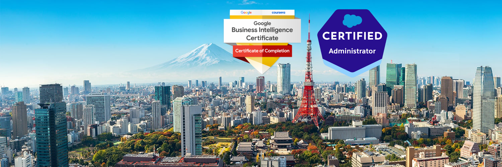
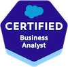

- After over 10 years in B2B sales I became passionate in managing projects, optimizing sales operations, Salesforce and business intelligence.
- I am Salesforce Admin certified and plan to take the Salesforce Business Analyst Certification shortly.
- I love studying the Japanese Language, backpacking and hiking in my free time.
- I created this Github because I love to learn and I have never used HTML in the past and wanted to try to turn my resume into a webpage. You can find it below.

- Shortly <a href="#" style="pointer-events: none;"> and then perhaps it is time to get my PMP.

 
- You can find my dashboard portfolio at  . 
- You can reach me at brianalcantara@gmail.com or connect with me on 

- If you would like to discuss career options, here is my full 

- Shorter 2 page PDF resume can be downloaded [here](https://github.com/BrianAlcantara/ResumePDF/blob/main/BRIAN%20ALCANTARA%20RESUME%202024.pdf#:~:text=Raw%20file%20content-,Download,-%E2%8C%98) and then clicking on the download button on the top right.

<!---
BrianAlcantara/BrianAlcantara is a ✨ special ✨ repository because its `README.md` (this file) appears on your GitHub profile.
You can click the Preview link to take a look at your changes.
--->
