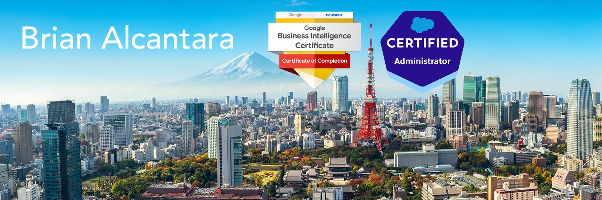

[]

- Hi, I’m Brian Alcantara
- I’m interested in optimizing sales operations, Salesforce, business intelligence and the Japanese Language.
- I am Salesforce Admin certified and will be taking the Salesforce Business Analyst Certification in January.
- You can find my Tableau Public portfolio at https://public.tableau.com/app/profile/brianalcantara/vizzes. I really enjoy making dashboards and finding ways to make business intelligence visualization the best it can be.
- You can reach me at brianalcantara@gmail.com or connect with me on linkedin at https://linkedin.com/in/briandesu/

<!---
BrianAlcantara/BrianAlcantara is a ✨ special ✨ repository because its `README.md` (this file) appears on your GitHub profile.
You can click the Preview link to take a look at your changes.
--->
